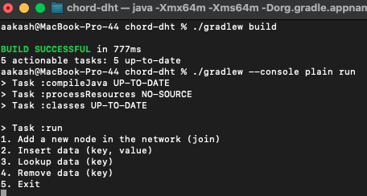
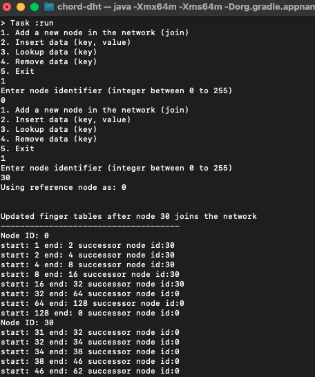

# Chord

Chord is a peer-to-peer, distributed lookup system that uses concepts of Distributed Hash Tables and Consistent Hashing 
to efficiently perform lookups in networks where nodes join and leave arbitrarily.  
Consistent hashing provides a way to quickly stabilize the network in such a dynamic environment, 
and it does so by re-distributing only a small fraction of keys (hence most of the nodes remain unaffected). 
     
This project is a Java based implementation of the core functionalities of Chord - joining of a node, construction and correction of finger tables and insertion, removal and lookup of keys.
For an in-depth understanding, refer the [Chord research paper](https://conferences.sigcomm.org/sigcomm/2001/p12-stoica.pdf).

## How to run (CLI)
After cloning the project, open up a terminal and from the project root directory issue the following commands:
1. `./gradlew build`
2. `./gradlew --console plain run` (--console plain removes unnecessary logs)

  
  
 Then, use the CLI options to interact with the application (1 to join a new node, 2 to insert data, etc..)  
 